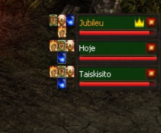

# Plano de Desenvolvimento & Sugestões
**MGM TOP MUSERVER**

---

## 🔴 Relatórios de Falhas (Bugs)
- **Nenhum registo:** Sem bugs reportados até ao momento.

---

## 🟠 Sistemas Pendentes de Análise (Verificações)
- **Sincronização de Efeitos:** Sincronizar visualmente os efeitos de *Seal of Wealth, Pet Panda e Demon* com o cliente. (Ex: se a EXP for alterada de 150% para 20% no servidor, o cliente continua a exibir 150%).
- **Mensagem de Gate:** Adicionar uma mensagem de notificação quando o jogador tentar usar um Gate sem ter os resets necessários (atualmente o `gate.txt` limita a passagem, mas o cliente não exibe aviso).
- **Dark Lord:** Verificar se, ao aplicar o reset, o DL também está a perder os pontos do atributo *Command* (Liderança).
- **Soma de Level + Master Level (Move):** Adicionar uma opção de configuração para que o sistema de *move* permita o acesso somando o Nível Base ao Master Level (ML). Exemplo: Para entrar num mapa que exige nível 600, uma personagem no Level 400 + 200 ML teria a entrada permitida.

---

## 🔵 Desenvolvimentos Importantes (Core Dev)

- **Nível de Move (MG/DL):** Igualar o nível necessário de *move* (tecla M) para Magic Gladiator e Dark Lord ao das outras classes, removendo a redução de nível (essencial para o balanceamento e progressão em servidores Hard).
- **OffHelper Nível Base:** Implementar o sistema OffHelper nativo, visto que o comando `/offattack` não funciona corretamente em servidores de 0 Resets.
- **OffHelper Pick:** Implementar a configuração de recolha automática de itens (Pick) no OffHelper, vinculando a permissão ao tipo de plano VIP do jogador.
- **OffHelper (Rebuff Automático):** Configurar para que, ao entrar numa Party, o sistema rebufe instantaneamente os membros, incluindo buffs essenciais de Rage Fighter (RF) e Blade Knight (BK).
- **Zen Party Share:** Implementar a divisão igualitária de Zen ganho quando em Party.
- **Guardar Zoom da Câmara:** O cliente deve guardar a preferência do nível de zoom da câmara ao fechar/abrir o jogo.
- **MapManager (StartGate):** Adicionar o parâmetro `StartGate` no MapManager para garantir que, ao mover de mapa, a personagem nasça sempre nas coordenadas exatas daquele gate.
- **Comando /readd:** Adicionar a opção de remover os efeitos/animações visuais dos buffs ao utilizar o comando para evitar o mau uso por parte dos jogadores (exemplo: aplicar buffs com o estado *Full Energy* e, em seguida, usar o `/readd` para transformar a elfa em *Full Agility*, mantendo a vantagem do buff).
- **Otimização CashShop (X):** Eliminar a necessidade de pressionar "Enter" a cada uso/compra de item, tornando a navegação mais rápida e fluida.
- **Venda Rápida (NPC):** Implementar o atalho `Ctrl + Clique do rato` para vender itens diretamente nos NPCs de forma instantânea.
- **Info Dinâmica de Monstros:** Permitir que o jogador mantenha a tecla `ALT` premida e passe o rato sobre um monstro para visualizar informações de combate em tempo real (Nível, HP, Dano Min/Max).
- **Sistema de Anúncios (Shift + Post):** Criar um atalho de anúncio global vinculando um item do inventário ao chat ao manter premida a tecla `Shift`, além de adicionar um ecrã dedicado (UI) para os jogadores visualizarem o histórico de itens anunciados no servidor.
- **Interface de Party (Buffs e Seals):** Exibir, ao lado da interface da Party, os ícones dos buffs que estão atualmente ativos nos membros do grupo, com a possibilidade de expandir a visualização para incluir também os seals ativos.
  
  

### Snippets de Configuração (Core)

**Exp Master em Party:**
```ini
PartyGeneralMasterExperience1 = 100
PartyGeneralMasterExperience2 = 105
PartyGeneralMasterExperience3 = 110
PartyGeneralMasterExperience4 = 115
PartyGeneralMasterExperience5 = 120
